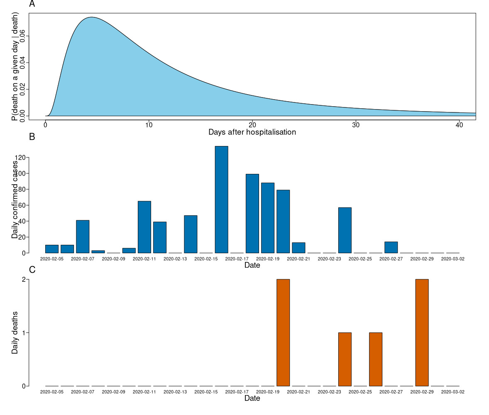

```{r setup, include=FALSE}
knitr::opts_chunk$set(echo = FALSE)
library(pander)
```

*Contributors: Timothy W. Russell, Joel Hellewell, Sam Abbott, Hamish Gibbs, Christopher I Jarvis, Kevin Van Zandvoort, CMMID nCoV working group, Rosalind M Eggo,  W John Edmunds, Adam J Kucharski*
  
  *Correspondence to: timothy.russell@lshtm.ac.uk* 

  
*Note: this is preliminary analysis, has not yet been peer-reviewed and is updated daily as new data becomes available.*

## Aim 

To estimate the case fatality ratio (CFR) of COVID-19, using data from the Diamond Princess cruise ship and correcting for delays between confirmation-and-death.

## Abstract

We calculate the case and infection fatality ratios for the outbreak of coronavirus disease (COVID-19) onboard the quarantined Japanese cruise ship the Diamond Princess. By comparing observed deaths on the Diamond Princess to the number of deaths expected using the CFR estimate for the COVID-19 outbreak in China, we estimate that the Chinese CFR estimate is inflated by 46% due to under-reporting and present adjusted severity estimates for the cruise ship data based on this.

## Main body

As of 3rd March, there have been 92,809 confirmed cases and 3,164 of coronavirus disease 2019 (COVID-19) [@WHOsitrep]. The disease has spread to 64 different countries in every continent except Antartica and the WHO risk assessment is now at “Very High” for China, the Regional level, and the Global level [@WHOsitrep].

On 1st February it emerged that a patient testing positive for COVID-19 in Hong Kong had recently disembarked from the cruise ship “Diamond Princess” on the 25th January and had experienced symptoms (a cough) since the 19th January, a day before boarding the Diamond Princess [@DiamondPrincessFieldBriefing1]. Upon returning to Yokohama, Japan on February 3rd the Diamond Princess was held in quarantine while testing was performed to assess the scale of COVID-19 transmission onboard.

Passengers were initially to be held in quarantine for 14 days, but passengers that were judged to have had further COVID-19 exposure, such as sharing a cabin with a confirmed case, were held in quarantine past the initial 14-day window. By February 20th, there were 634 confirmed cases onboard, with 328 of these being asymptomatic, overall 3,063 PCR tests were performed, primarily in elderly ‘high-risk’ groups [@DiamondPrincessFieldBriefing2].

Collecting such detailed epidemiological information from a captive population allows for less biased estimates of the proportions of symptomatic cases and overall cases that result in death, referred to as the case fatality ratio (CFR) and infection fatality ratio (IFR) respectively. The intensive testing carried out on the Diamond Princess lowers the probability that asymptomatic or subclinical cases go undetected. Trying to estimate the IFR from reported cases can significantly overestimate the IFR since cases without symptoms will not report and will go uncounted.

### Corrected IFR and CFR estimates

Typically, what is known as the naive CFR (nCFR) - which is simply the ratio of deaths and cases - is reported to assess the fatality rate of an infectious disease. However, we statistically need to correct for the delay between diagonsis of the disease and outcome of the patient (recovery or death) if this is to be accurately calculated during an ongoing epidemic [@kucharski2014case]. Case fatality ratios (CFR) must be corrected to account for infections that are currently confirmed but are yet to result in recovery or death yet [@nishiura2009early]. Including such cases in the CFR calculation without adjustment results in underestimation of the true CFR value [@kucharski2014case].

We use distributions for the time from case confirmation until death, as well as the time from hospitalisation to death, estimated from the COVID-19 outbreak in Wuhan, China [@linton2020incubation]. The hospitalisation-to-death distributions have a mean of 14.5 days and 20.2 days for the non-truncated and truncated versions respectively, the truncated distribution attempts to account for right-censoring in the outbreak data due to unknown disease outcomes (Figure 1, panels A and B). We then use the known proportions of asymptomatic to symptomatic cases to scale the cCFR to estimate the infection fatality ratio (IFR).

To correct the CFR, we use the case and death incidence data in the following equation from @nishiura2009early, given by
$$
u_{t} = \frac{\sum_{i = 0}^t \sum_{j = 0}^{\infty} c_{i-j} f_j}{\sum_{i = 0}^t c_i},
$$
where $c_{t}$ is the daily case incidence at time $t$, $f_t$ is the delay distribution between onset or hospitalisation and death evaluated at time $t$. This $u_t$ quantity gives you what is known as the underestimation of the known outcomes and is used as the denominator in the overall calculation of the corrected CFR (cCFR) instead of raw case numbers. This typically leads to an increase between the nCFR and the cCFR, as it predicts the outcome of a number of the current cases within the calculation. It has been shown to be very accurate when an epidemic is over at predicting the true CFR - at the end of an epidemic the nCFR and cCFR converge as the each of the cases is resolved. 

We estimate that the cCFR and the cIFR for COVID-19 are 1.2% (0.38% - 2.7%) and 2.3% (0.75% - 5.3%) respectively (Table 1). 

| Age Range | cIFR | cCFR | Distribution |
| ----------- | ----------- | ----------- | ----------- |
| All ages combined | 0.91% (0.11% - 4.3%) | 1.9% (0.60% - 4.3%) | hospitalisation-to-death non-truncated (Figure 2A) |
|        |1.2% (0.38% - 2.7%) | 2.3% (0.75% - 5.3%) | hospitalisation-to-death truncated (Figure 2B) |

*Table 1: Corrected IFR and CFR estimates calculated using the reported case and death data on the Diamond Princess cruise ship [@DiamondPrincessFieldBriefing1]. Correction was performed using equation (1) and the distribution used within this correction was the hospitalisation-to-death distribution given in [@linton2020incubation]. There are another 25 cases, but we did not include them as their data was not present in [@DiamondPrincessFieldBriefing2] and no age stratification or symptomatic/asymptomatic data was available for them.*

```{r fig_Main, echo=FALSE, fig.align='center', fig.cap="_Figure 1: Corrected CFR timeseries and the distributions & data used to calculate the estimates. Panel A: the delay distributions of onset-to-death in cases with fatal outcomes (Top panel) - both are Lognormal distribution fits taken from Linton et al. A). Non-truncated distribution, mean of 14.5 days and SD of 6.7 days. B). Right-truncated distribution of onset-to-death, mean of 20.2 days and SD of 11.6 day. Panel B: The corrected IFR and CFR estimates over time, with 95% confidence intervals. Panels D and E: the case and death timeseries (respectively)._", out.width = '70%'}

```


| Age Range | symptomatic | asymptomatic | Proportion | nCFR | Expected deaths using nCFR |
  | -----------   | ----------- | -----------  | ----------- | ----------- | ----------- |
  | 0 - 9   | 0   | 1   |  0%  | 0.0%  | 0     |
  | 10 - 19 | 2   | 3   |  40% | 0.2%  | 0     |
  | 20 - 29 | 25  | 3   |  89% | 0.2%  | 0.05  |
  | 30 - 39 | 27  | 7   |  79% | 0.2%  | 0.06  |
  | 40 - 49 | 19  | 8   |  70% | 0.4%  | 0.08  |
  | 50 - 59 | 28  | 31  |  47% | 1.3%  | 0.36  |
  | 60 - 69 | 76  | 101 |  43% | 3.6%  | 2.74  |
  | 70 - 79 | 95  | 139 |  41% | 8.0%  | 7.57  |
  | 80 - 89 | 29  | 25  |  53% | 14.8% | 4.28  |
  |         |     |     |      |       |       |
  | Totals  | 301 | 318 | 49%  |       | 15.15 |

*Table 2: \ageStratAsymptomatic Age stratified data of symptomatic and asymptomatic cases on-board the Diamond Princess [@DiamondPrincessFieldBriefing1], [@DiamondPrincessFieldBriefing2], along with the naive CFR estimates given by the cCDC (ref?) and the expected number of cases in each age group if the nCFR estimates were correct where the total number of expected deaths under these estimates was 15.15.*


### Adjusted age stratified severity estimates

Using the Chinese CDC age stratified CFR estimates (ref), we calculate the expected number of deaths on-board the Diamond Princess within each age group. This results in a total of 15.15 expected deaths, which gives a CFR estimate (15.15/301) = 5% (Table 2). Given that our corrected CFR estimates are 2.3%, we arrive at an scaling of 46% between the two estimates. Using this scaling, we are then able to adjust the China CDC age stratified severity estimates. Doing so results in the following proportion estimates: symptomatic cases that were severe is 6.9% (2.2% - 15.8%), symptomatic cases that were critical is 2.3% (0.8% - 5.3%), total hospitalisation is 9.1% (3.0% - 21.1%), the adjusted overall CFR is 1.1% (0.3% - 2.4%) and the adjusted overall IFR is 0.5% (0.2% - 1.2%). The confidence intervals are calculated by scaling the 95% confidence intervals given in the corrected CFR and IFR estimates.

We then apply these severity estimates to the age stratified case data on the cruise ship, giving the results shown in Table 3.

In doing so, we arrive at age stratified CFR results for China (Table 3)


|           |       Proportion of infections        |       
| ----------|  -----------     | -----------  | ----------- |
| Age Range | Hospitalised     | Critical     |  Fatal      | 
| 0 - 9     | 0%               | 1            |  0%         | 
| 10 - 19   | 1%               | 3            |  0.2%       |
| 20 - 29   | 1%               | 3            |  0.2%       |
| 30 - 39   | 1%               | 7            |  0.3%       |
| 40 - 49   | 2%               | 8            |  0.5%       |
| 50 - 59   | 6%               | 31           |  1.4%       |
| 60 - 69   | 16%              | 101          |  3.9%       |
| 70 - 79   | 35%              | 139          |  8.7%       |
| 80 - 89   | 64%              | 25           |  16.1%      |
|           |                  |              |             | 
| Totals    | 301              | 318          | 49%         | 

*Table 3: \adjustedData Age stratified data of different severity levels of cases on-board the Diamond Princess [@DiamondPrincessFieldBriefing1], [@DiamondPrincessFieldBriefing2], estimated by adjusting the China CDC severity estimates (ref) by rescaling their estimaes by the difference in our two CFR estimates.*


Case fatality estimates are notoriously difficult during an ongoing epidemic. Especially one with attributes similar to the one of COVID-19, given that it has long delays between onset and hospitalisation-to-death and depends strongly on age and comorbidity of the individual. Two of the largest sources of bias within such a calculation are level of under/over reporting of cases and the difference in cases between now and when the current cases have had their outcomes resolved. We use a statistical correction method to adjust the estimates to account for the increase in known outcomes between the current case count and the current death count. Furthermore, we do so on a dataset which inherently has far lower reporting error, given its special circumstances, i.e. every individual was tested and the test has high levels of sensitivity.

Our adjustments to the Diamond Princess age stratified figures make some assumptions. Firstly, they assume the effects of the care provided on the Diamond Princess are simialr to that of the care provided in China. This is clearly a limitation of our method, but to the extent that the care on the Diamond Princess lowered the case of severe symptoms is unknown, as patients had very little medical attention during their mandatory quarantine, given a postive PCR test for SARS-CoV-2 [@DiamondPrincessFieldBriefing2]. However, even though the severity estimates are crude, they are a significant improvement on the naive calculations routinely dissemintated during an epidemic, in which the biases and statistical errors have been shown to be significant when the outbreak in question has ended [@kucharski2014case].


## References

<div id = 'refs'></div>
